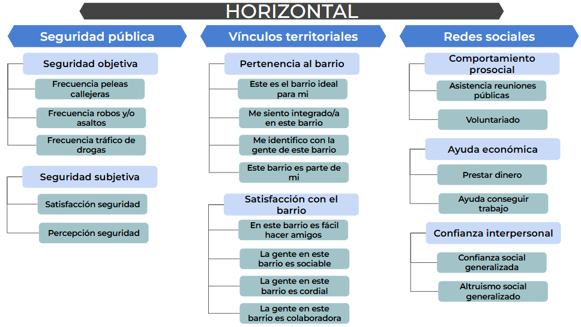

# Marco Conceptual

El Observatorio de Cohesión Social (OCS-COES) ha avanzado hacia una definición del concepto de cohesión social basada en Chan et al. (2006), con un enfoque bidimensional: Cohesión Horizontal (relaciones entre individuos y grupos) y Cohesión Vertical (interacciones entre individuos e instituciones).

Esta definición minimalista responde críticamente a aproximaciones previas que tendían a confundir los contenidos de la cohesión social con sus condiciones externas, tales como la pobreza, la igualdad de oportunidades o la tolerancia. El enfoque adoptado permite precisar los elementos constitutivos de la cohesión sin diluir su valor analítico, estableciendo una distinción clara entre componentes subjetivos (actitudes y percepciones) y objetivos (comportamientos y prácticas observables).

# Antecedentes de Medición

El equipo del OCS ha desarrollado dos propuestas previas de medición de cohesión social que constituyen los antecedentes directos de la nueva aproximación presentada en este documento.

## Vis-Latam: Medición Regional Comparativa

La primera iniciativa del OCS, orientada a la comparación entre países de América Latina, utilizó datos de encuestas internacionales (LAPOP/WVS/Latinobarómetro) para construir indicadores de cohesión horizontal (confianza interpersonal y seguridad pública) y cohesión vertical (confianza institucional, actitudes democráticas y justicia distributiva). Esta propuesta estableció una línea base regional, aunque enfrentó limitaciones propias de fuentes no diseñadas específicamente para medir cohesión social.

## Castillo, Iturra y Carrasco (2021): Una primera propuesta nacional desde ELSOC

La propuesta de Castillo et al. (2021) aprovechó la riqueza de ELSOC para desarrollar una medición comprehensiva específica para Chile. Organizó la cohesión horizontal en sentido de pertenencia, confianza social, cohesión barrial y participación prosocial; mientras que la cohesión vertical incluyó confianza institucional, participación política y justicia distributiva. Esta aproximación incorporó la distinción entre indicadores subjetivos (actitudes) y objetivos (prácticas), estableciendo un marco más robusto para el análisis longitudinal.

## Diferencias y Continuidades

Ambas propuestas comparten el marco bidimensional horizontal-vertical y el enfoque minimalista, pero difieren en granularidad analítica y estructura factorial. La versión regional priorizó la comparabilidad internacional, mientras que la propuesta ELSOC privilegió la especificidad del contexto chileno. Estas diferencias reflejan tanto las posibilidades y limitaciones de cada fuente de datos como las decisiones metodológicas orientadas por objetivos analíticos distintos.

# Nueva Propuesta de medición con ELSOC


{width=300px}

La nueva propuesta del OCS integra y expande las mediciones previas con innovaciones que permiten capturar con mayor precisión las dinámicas de cohesión en Chile, manteniendo coherencia con el marco minimalista bidimensional.

## Cohesión Horizontal

La dimensión horizontal se estructura en tres áreas que integran condiciones objetivas, percepciones subjetivas y prácticas sociales:

### Seguridad

Reconoce la seguridad como dimensión autónoma, distinguiendo entre **seguridad objetiva** (frecuencia de peleas callejeras y robos/asaltos en el barrio) y **seguridad subjetiva** (percepción de tráfico de drogas, satisfacción con la seguridad barrial y sensación personal de seguridad). Esta distinción permite observar tanto la realidad material del entorno como la experiencia vivida de los residentes.


### Vínculos Territoriales

Distingue analíticamente entre **pertenencia al barrio** (considerarlo ideal, sentirse integrado, identificarse con la gente y percibir el barrio como parte de la identidad) y **satisfacción con el barrio** (facilidad para hacer amigos, percepción de sociabilidad, cordialidad y colaboración vecinal). Esta separación permite observar que los vínculos identitarios y la evaluación de las relaciones sociales pueden no coincidir, capturando aspectos complementarios de la cohesión territorial.

### Redes Sociales

Reorganiza la medición diferenciando tres tipos de solidaridad social: **confianza interpersonal** (confianza social generalizada y altruismo social), **comportamiento prosocial** (asistencia a reuniones comunitarias y voluntariado) y **ayuda económica** (prestar dinero y ayudar a conseguir trabajo). Esta estructura reconoce que son formas distintas de solidaridad que pueden no correlacionar perfectamente entre sí.

## Cohesión Vertical

La dimensión vertical se reorganiza en cuatro áreas que capturan las múltiples facetas de la relación ciudadano-instituciones:

### Confianza en Instituciones

Focaliza en la **confianza en instituciones políticas**, integrando confianza en el gobierno, congreso nacional y partidos políticos como expresión de la confianza en el sistema democrático-representativo.


### Prácticas y Actitudes Políticas

Integra **participación política** (firmas, marchas, huelgas, uso de redes sociales), **autoeficacia política** (percepción del voto como deber, influencia y expresión) e **interés político** (declarado, conversacional y informativo) en una dimensión que reconoce la interdependencia entre prácticas ciudadanas, percepciones de eficacia y compromiso subjetivo con lo político.

### Preferencias por Sistema Político

Distingue entre **preferencias autoritarias** (gobierno firme, mandatario fuerte, obediencia y disciplina) y **actitudes hacia la democracia** (satisfacción con el funcionamiento democrático). Esta distinción permite observar tensiones y ambivalencias en las orientaciones políticas, donde pueden coexistir insatisfacción democrática y rechazo al autoritarismo.

### Justicia Distributiva

Se enfoca en preferencias sobre el rol del mercado en derechos fundamentales, midiendo el acuerdo con que quien tiene más dinero acceda a mejores pensiones, educación y salud. Esta aproximación captura directamente las orientaciones normativas sobre justicia distributiva en áreas centrales del debate público chileno.

# Valor Agregado de la Nueva Propuesta

La propuesta OCS-ELSOC representa un avance sustantivo en la medición de cohesión social en Chile, integrando y expandiendo aproximaciones previas:

**Innovaciones en Cohesión Horizontal**

1. **Autonomía de la seguridad:** Reconoce la seguridad como dimensión fundamental, distinguiendo entre condiciones objetivas y vivencia subjetiva del entorno
2. **Diferenciación territorial:** Separa pertenencia identitaria de evaluación de relaciones vecinales
3. **Tipología de solidaridad:** Distingue solidaridad actitudinal (confianza), comunitaria (prosocialidad) y económica (ayuda material)

**Innovaciones en Cohesión Vertical**

1. **Especificación institucional:** Diferencia confianza en instituciones políticas y de orden
2. **Integración política:** Articula participación, autoeficacia e interés como dimensiones interrelacionadas del vínculo ciudadano
3. **Incorporación de autoritarismo:** Captura tensiones y ambivalencias en orientaciones políticas
4. **Reformulación distributiva:** Enfoca en preferencias sobre rol del mercado en derechos fundamentales

Esta arquitectura integra condiciones objetivas, percepciones subjetivas, prácticas sociales y orientaciones normativas, manteniendo coherencia con el marco minimalista de Chan et al. (2006) mientras aprovecha las posibilidades que ofrece ELSOC para una medición comprehensiva de la cohesión social en Chile.

# Cohesión Social en tiempos de desafección en Chile: Un análisis con una propuesta desde ELSOC

Teniendo esta nueva propuesta de medición de cohesión social, se presentaun análisis empírico de los datos con ELSOC para examinar cómo se comportan estas dimensiones en la realidad chilena. 

En este apartado, se verá la aplicación práctica de los indicadores desarrollados, explorando tanto la estructura factorial de las dimensiones propuestas como sus patrones de variación a lo largo del tiempo y entre diferentes grupos sociales. Los análisis que siguen buscan validar empíricamente la propuesta teórica presentada, identificar tendencias en la cohesión social chilena, y proporcionar evidencia sobre las dinámicas específicas que caracterizan tanto la cohesión horizontal (vínculos entre personas y con el territorio) como la cohesión vertical (relaciones ciudadano-instituciones) en el contexto nacional. 

A través de estos análisis, se pretende no solo confirmar la pertinencia de la propuesta de medición, sino también generar conocimiento sustantivo sobre el estado y evolución de la cohesión social en Chile durante el período cubierto por ELSOC.

```{r}
#| echo: false
#| warning: false
#| message: false

# 1. Packages  -----------------------------------------------------
if (! require("pacman")) install.packages("pacman")

pacman::p_load(tidyverse,
               car,
               sjmisc, 
               here,
               sjlabelled,
               SciViews,
               naniar,
               readxl,
               sjPlot)


options(scipen=999)
rm(list = ls())
```

```{r}
#| echo: false
#| warning: false
#| message: false

# 2. Data -----------------------------------------------------------------

load(file = here("data/bases-vis-elsoc/db_madre.RData"))


```


```{r}
#| label: fig-inst
#| echo: false
#| warning: false
#| message: false

# 1. Confianza en instituciones políticas
# a) Por grupo de ingreso
db_conf_inst_ing <- db_madre %>%
  drop_na(ola, grupo_ingreso, sd_conf_inst_pol) %>%
  mutate(alto = ifelse(sd_conf_inst_pol >= 4, 1, 0)) %>%
  group_by(ola, grupo_ingreso) %>%
  summarise(prop = mean(alto, na.rm = TRUE) * 100,
            n = n(),
            se = sqrt(prop * (100 - prop) / n)) %>%
  ungroup()

ggplot(db_conf_inst_ing, aes(x = ola, y = prop, color = grupo_ingreso, group = grupo_ingreso)) +
  geom_line(size = 1) + geom_point() +
  geom_errorbar(aes(ymin = prop - se, ymax = prop + se), width = 0.1, alpha = 0.5) +
  labs(title = "Confianza alta en instituciones políticas por ingreso", 
       x = "Ola", y = "% con confianza alta (4-5)", color = "Ingreso") +
  theme_minimal(base_size = 14)

# b) Por nivel educativo
db_conf_inst_edu <- db_madre %>%
  drop_na(ola, educacion, sd_conf_inst_pol) %>%
  mutate(alto = ifelse(sd_conf_inst_pol >= 4, 1, 0)) %>%
  group_by(ola, educacion) %>%
  summarise(prop = mean(alto, na.rm = TRUE) * 100,
            n = n(),
            se = sqrt(prop * (100 - prop) / n)) %>%
  ungroup()

ggplot(db_conf_inst_edu, aes(x = ola, y = prop, color = educacion, group = educacion)) +
  geom_line(size = 1) + geom_point() +
  geom_errorbar(aes(ymin = prop - se, ymax = prop + se), width = 0.1, alpha = 0.5) +
  labs(title = "Confianza alta en instituciones políticas por nivel educativo", 
       x = "Ola", y = "% con confianza alta (4-5)", color = "Educación") +
  theme_minimal(base_size = 14)

# c) Por ideología
db_conf_inst_ideo <- db_madre %>%
  drop_na(ola, ideologia, sd_conf_inst_pol) %>%
  mutate(alto = ifelse(sd_conf_inst_pol >= 4, 1, 0)) %>%
  group_by(ola, ideologia) %>%
  summarise(prop = mean(alto, na.rm = TRUE) * 100,
            n = n(),
            se = sqrt(prop * (100 - prop) / n)) %>%
  ungroup()

ggplot(db_conf_inst_ideo, aes(x = ola, y = prop, color = ideologia, group = ideologia)) +
  geom_line(size = 1) + geom_point() +
  geom_errorbar(aes(ymin = prop - se, ymax = prop + se), width = 0.1, alpha = 0.5) +
  labs(title = "Confianza alta en instituciones políticas por ideología", 
       x = "Ola", y = "% con confianza alta (4-5)", color = "Ideología") +
  theme_minimal(base_size = 14)

```


```{r}
#| label: fig-satis
#| echo: false
#| warning: false
#| message: false

# 2. Satisfacción con la democracia
# a) Por grupo de ingreso
db_satdem_ing <- db_madre %>%
  drop_na(ola, grupo_ingreso, in_sat_democracia) %>%
  mutate(alto = ifelse(in_sat_democracia >= 4, 1, 0)) %>%
  group_by(ola, grupo_ingreso) %>%
  summarise(prop = mean(alto, na.rm = TRUE) * 100,
            n = n(),
            se = sqrt(prop * (100 - prop) / n)) %>%
  ungroup()

ggplot(db_satdem_ing, aes(x = ola, y = prop, color = grupo_ingreso, group = grupo_ingreso)) +
  geom_line(size = 1) + geom_point() +
  geom_errorbar(aes(ymin = prop - se, ymax = prop + se), width = 0.1, alpha = 0.5) +
  labs(title = "Satisfacción alta con la democracia por ingreso", 
       x = "Ola", y = "% con satisfacción alta (4-5)", color = "Ingreso") +
  theme_minimal(base_size = 14)

# b) Por nivel educativo
db_satdem_edu <- db_madre %>%
  drop_na(ola, educacion, in_sat_democracia) %>%
  mutate(alto = ifelse(in_sat_democracia >= 4, 1, 0)) %>%
  group_by(ola, educacion) %>%
  summarise(prop = mean(alto, na.rm = TRUE) * 100,
            n = n(),
            se = sqrt(prop * (100 - prop) / n)) %>%
  ungroup()

ggplot(db_satdem_edu, aes(x = ola, y = prop, color = educacion, group = educacion)) +
  geom_line(size = 1) + geom_point() +
  geom_errorbar(aes(ymin = prop - se, ymax = prop + se), width = 0.1, alpha = 0.5) +
  labs(title = "Satisfacción alta con la democracia por nivel educativo", 
       x = "Ola", y = "% con satisfacción alta (4-5)", color = "Educación") +
  theme_minimal(base_size = 14)

# c) Por ideología
db_satdem_ideo <- db_madre %>%
  drop_na(ola, ideologia, in_sat_democracia) %>%
  mutate(alto = ifelse(in_sat_democracia >= 4, 1, 0)) %>%
  group_by(ola, ideologia) %>%
  summarise(prop = mean(alto, na.rm = TRUE) * 100,
            n = n(),
            se = sqrt(prop * (100 - prop) / n)) %>%
  ungroup()

ggplot(db_satdem_ideo, aes(x = ola, y = prop, color = ideologia, group = ideologia)) +
  geom_line(size = 1) + geom_point() +
  geom_errorbar(aes(ymin = prop - se, ymax = prop + se), width = 0.1, alpha = 0.5) +
  labs(title = "Satisfacción alta con la democracia por ideología", 
       x = "Ola", y = "% con satisfacción alta (4-5)", color = "Ideología") +
  theme_minimal(base_size = 14)

```


```{r}
#| label: fig-seg
#| echo: false
#| warning: false
#| message: false

# 3. Seguridad pública (subjetiva)
# a) Por grupo de ingreso
db_segpub_ing <- db_madre %>%
  drop_na(ola, grupo_ingreso, di_seguridad_pub) %>%
  group_by(ola, grupo_ingreso) %>%
  summarise(media = mean(di_seguridad_pub),
            se = sd(di_seguridad_pub) / sqrt(n())) %>%
  ungroup()

ggplot(db_segpub_ing, aes(x = ola, y = media, color = grupo_ingreso, group = grupo_ingreso)) +
  geom_line(size = 1) + geom_point() +
  geom_errorbar(aes(ymin = media - se, ymax = media + se), width = 0.1, alpha = 0.5) +
  labs(title = "Seguridad pública por ingreso", x = "Ola", y = "Promedio", color = "Ingreso") +
  theme_minimal(base_size = 14)

# b) Por nivel educativo
db_segpub_edu <- db_madre %>%
  drop_na(ola, educacion, di_seguridad_pub) %>%
  group_by(ola, educacion) %>%
  summarise(media = mean(di_seguridad_pub),
            se = sd(di_seguridad_pub) / sqrt(n())) %>%
  ungroup()

ggplot(db_segpub_edu, aes(x = ola, y = media, color = educacion, group = educacion)) +
  geom_line(size = 1) + geom_point() +
  geom_errorbar(aes(ymin = media - se, ymax = media + se), width = 0.1, alpha = 0.5) +
  labs(title = "Seguridad pública por nivel educativo", x = "Ola", y = "Promedio", color = "Educación") +
  theme_minimal(base_size = 14)

# c) Por ideología
db_segpub_ideo <- db_madre %>%
  drop_na(ola, ideologia, di_seguridad_pub) %>%
  group_by(ola, ideologia) %>%
  summarise(media = mean(di_seguridad_pub),
            se = sd(di_seguridad_pub) / sqrt(n())) %>%
  ungroup()

ggplot(db_segpub_ideo, aes(x = ola, y = media, color = ideologia, group = ideologia)) +
  geom_line(size = 1) + geom_point() +
  geom_errorbar(aes(ymin = media - se, ymax = media + se), width = 0.1, alpha = 0.5) +
  labs(title = "Seguridad pública por ideología", x = "Ola", y = "Promedio", color = "Ideología") +
  theme_minimal(base_size = 14)
```