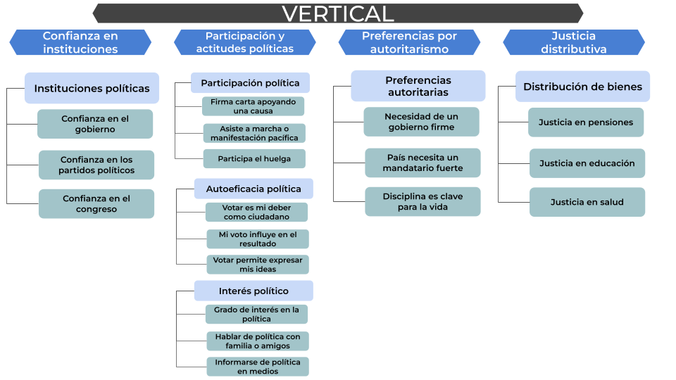

```{r}
#| echo: false
#| warning: false
#| message: false

# 1. Packages  -----------------------------------------------------
if (! require("pacman")) install.packages("pacman")

pacman::p_load(tidyverse,
               car,
               sjmisc, 
               here,
               sjlabelled,
               SciViews,
               naniar,
               readxl,
               sjPlot)


options(scipen=999)
rm(list = ls())
```

```{r}
#| echo: false
#| warning: false
#| message: false

# 2. Data -----------------------------------------------------------------

load(file = here("input/data/proc_data/bivariados_long_categoricos.RData"))
```

¿Cómo podemos saber si ha cambiado o no la cohesión social en Chile? Para responder, partimos por una definición mínima y operativa. Siguiendo a Chan et al. (2006), entendemos la cohesión social como la calidad de los vínculos entre personas (plano horizontal) y entre ciudadanía e instituciones (plano vertical). Esta definición se traduce en una medición con dimensiones y subdimensiones explícitas, comparable en el tiempo.

Contamos con un instrumento privilegiado para ello: la Encuesta Longitudinal Social de Chile (ELSOC), realizada por COES. ELSOC ofrece datos panel entre 2016 y 2023, con diseño longitudinal y tamaños muestrales por ola en el orden de miles (ver sección de Datos), una ventaja prácticamente única en América Latina para estudiar cambios en cohesión social. Esta propuesta, además, se acompaña del Visualizador ELSOC del Observatorio de Cohesión Social (OCS), que permitirá a cualquier persona explorar los indicadores, realizar cruces y responder sus propias preguntas; en esa línea, el Observatorio ya opera un visualizador regional (VIS-LATAM) que servirá de referencia.

En este informe presentamos la organización de la medición en planos, dimensiones y subdimensiones, y mostramos —a modo de ejemplo— análisis empíricos con ELSOC que ilustran brechas y trayectorias por grupo social a lo largo del período 2016–2023.


# Conceptos y medición de Cohesión Social en perspectiva longitudinal 

{width=300px}
{width=300px}

Con la nueva propuesta de medición, presentamos un análisis empírico con ELSOC que aplica los indicadores, evalúa su estructura factorial y describe su variación en el tiempo y entre grupos sociales. Este ejercicio busca validar la propuesta teórica, identificar tendencias de la cohesión social en Chile y aportar evidencia sobre las dinámicas de la cohesión horizontal (vínculos entre personas y territorio) y vertical (relación ciudadano–instituciones). En conjunto, los resultados permiten confirmar la pertinencia del enfoque y generar conocimiento sustantivo sobre el estado y la evolución de la cohesión social en el período cubierto por ELSOC.

Retomando el marco minimalista de Chan et al. (2006) para la cohesión social, se distinguen dos planos complementarios. 

## Cohesión Horizontal 

En el plano horizontal —vínculos entre personas y territorios— la medición se organiza en 3 dimensiones con sus subdimensiones e indicadores: (i) seguridad (objetiva y subjetiva); (ii) vínculos territoriales (pertenencia/identificación y satisfacción barrial); y (iii) redes sociales (confianza interpersonal, prosocialidad y ayuda económica). Estos bloques se observan de forma consistente en ELSOC, lo que permite comparar cambios a lo largo del tiempo. A continuación se presentan cruces por ingreso y educación para la dimensión de seguridad pública que ilustran su desempeño; los mismos análisis podrán replicarse en el Visualizador ELSOC del Observatorio de Cohesión Social (OCS).

### Seguridad Pública

Los gráficos de seguridad alta (evaluaciones 4-5 en la escala) muestran dinámicas distintas pero igualmente reveladoras.

```{r}
#| label: fig-seg-pub
#| fig-cap: "Porcentaje de personas que sienten un alto nivel de seguridad pública"
#| echo: false
#| warning: false
#| message: false
#| fig-width: 10
#| fig-height: 12

# Definir colores COES
colores_coes <- c("#824293", "#487FD3", "#7ABA21", "#FFCE00", "#F9913D", "#FF3E4E")

# 1. Seguridad pública

# a) Por grupo de ingreso
ingreso_seg <- ingreso_categ %>% 
  filter(categoria == "Alto", subdimension == "Seguridad pública") %>%
  mutate(prop = prop * 100)

# Calcular N total
n_total_seg <- ingreso_categ %>% 
  filter(subdimension == "Seguridad pública") %>%
  summarise(n = sum(n, na.rm = TRUE)) %>% 
  pull(n)

p4 <- ggplot(ingreso_seg, aes(x = ola, y = prop, color = grupo_ingreso, group = grupo_ingreso)) +
  geom_line(linewidth = 1.5) + 
  geom_point(size = 3) +
  scale_color_manual(values = colores_coes) +
  scale_y_continuous(limits = c(0, 100), 
                     breaks = c(0, 5, 10, 15, 20, 25, 30, 40, 50, 60, 70, 80, 90, 100),
                     minor_breaks = seq(0, 100, 5),
                     labels = function(x) paste0(x, "%"),
                     expand = expansion(mult = c(0, 0.02))) +
  scale_x_continuous(breaks = unique(ingreso_seg$ola),
                     expand = expansion(mult = c(0.02, 0.02))) +
  labs(title = "Porcentaje de personas con alta percepción de seguridad según ingresos", 
       x = NULL,
       y = "% con seguridad alta (3-5)", 
       color = "Ingreso",
       caption = paste0("Fuente: ELSOC (2016-2023). N=", format(n_total_seg, big.mark = "."))) +
  theme_minimal(base_size = 14) +
  theme(legend.position = "top",
        plot.title = element_text(size = 12, face = "bold"),
        axis.text = element_text(size = 11),
        legend.text = element_text(size = 11),
        plot.margin = margin(2, 2, 2, 2),
        legend.margin = margin(0, 0, 0, 0),
        legend.box.margin = margin(0, 0, 0, 0),
        panel.grid.minor = element_line(color = "gray90", linewidth = 0.3))

# b) Por nivel educativo
cine_seg <- cine_categ %>% 
  filter(categoria == "Alto", subdimension == "Seguridad pública") %>%
  mutate(prop = prop * 100)

# Calcular N total
n_total_seg_cine <- cine_categ %>% 
  filter(subdimension == "Seguridad pública") %>%
  summarise(n = sum(n, na.rm = TRUE)) %>% 
  pull(n)

p5 <- ggplot(cine_seg, aes(x = ola, y = prop, color = cine, group = cine)) +
  geom_line(linewidth = 1.5) + 
  geom_point(size = 3) +
  scale_color_manual(values = colores_coes) +
  scale_y_continuous(limits = c(0, 100), 
                     breaks = c(0, 5, 10, 15, 20, 25, 30, 40, 50, 60, 70, 80, 90, 100),
                     minor_breaks = seq(0, 100, 5),
                     labels = function(x) paste0(x, "%"),
                     expand = expansion(mult = c(0, 0.02))) +
  scale_x_continuous(breaks = unique(cine_seg$ola),
                     expand = expansion(mult = c(0.02, 0.02))) +
  labs(title = "Porcentaje de personas con alta percepción de seguridad según educación", 
       x = NULL,
       y = "% con seguridad alta (3-5)", 
       color = "Educación", 
       caption = paste0("Fuente: ELSOC (2016-2023). N=", format(n_total_seg_cine, big.mark = "."))) +
  theme_minimal(base_size = 14) +
  theme(legend.position = "top",
        plot.title = element_text(size = 12, face = "bold"),
        axis.text = element_text(size = 11),
        legend.text = element_text(size = 11),
        plot.margin = margin(2, 2, 2, 2),
        legend.margin = margin(0, 0, 0, 0),
        legend.box.margin = margin(0, 0, 0, 0),
        panel.grid.minor = element_line(color = "gray90", linewidth = 0.3))

print(p4)
print(p5)

```

Las trayectorias de seguridad muestran convergencia en 2016–2018 y peaks similares en 2019 (≈47–50% bajos, ≈57% medios, ≈61% altos). Tras 2019 hay una caída generalizada con estratificación persistente: en 2023 altos ≈61%, medios ≈52% y bajos ≈43%. En conjunto con la confianza institucional, 2019 es un punto de inflexión; la seguridad cambia de forma más gradual y las brechas por estatus (ingreso/educación) se mantienen o se amplían, con niveles sistemáticamente mayores entre los grupos aventajados.

## Cohesión Vertical

En el plano vertical —relación ciudadanía–instituciones— consideramos 4 dimensiones: (i) confianza en instituciones políticas; (ii) prácticas y actitudes políticas (participación, autoeficacia e interés); (iii) preferencias por sistema político (autoritarismo vs. democracia); y (iv) justicia distributiva (preferencias sobre la provisión de bienestar social por el mercado). Este conjunto integra prácticas y orientaciones, capturando variaciones longitudinales. Tras esta sección se muestran cruces análogos por ingreso y educación para la dimensión de Confianza en las Instituciones Políticas también disponibles en el Visualizador ELSOC del Observatorio de Cohesión Social (OCS) para su exploración.

### Confianza en Instituciones Políticas

Los gráficos de confianza en instituciones políticas revelan patrones diferenciados según las variables sociodemográficas analizadas:

```{r}
#| label: fig-conf-inst-pol
#| fig-cap: "Porcentaje de personas que confían altamente en instituciones políticas"
#| echo: false
#| warning: false
#| message: false
#| fig-width: 10
#| fig-height: 12

# 2. Confianza en instituciones políticas

# a) Por grupo de ingreso
ingreso_conf <- ingreso_categ %>% 
  filter(categoria == "Alto", subdimension == "Confianza en instituciones políticas") %>%
  mutate(prop = prop * 100)

# Calcular N total
n_total <- ingreso_categ %>% 
  filter(subdimension == "Confianza en instituciones políticas") %>%
  summarise(n = sum(n, na.rm = TRUE)) %>% 
  pull(n)

p1 <- ggplot(ingreso_conf, aes(x = ola, y = prop, color = grupo_ingreso, group = grupo_ingreso)) +
  geom_line(linewidth = 1.5) + 
  geom_point(size = 3) +
  scale_color_manual(values = colores_coes) +
  scale_y_continuous(limits = c(0, 100), 
                     breaks = c(0, 5, 10, 15, 20, 25, 30, 40, 50, 60, 70, 80, 90, 100),
                     minor_breaks = seq(0, 100, 5),
                     labels = function(x) paste0(x, "%"),
                     expand = expansion(mult = c(0, 0.02))) +
  scale_x_continuous(breaks = unique(ingreso_conf$ola),
                     expand = expansion(mult = c(0.02, 0.02))) +
  labs(title = "Porcentaje de personas que confían altamente en instituciones políticas según ingresos", 
       x = NULL, 
       y = "% con confianza alta (3-5)", 
       color = "Ingreso", 
       caption = paste0("Fuente: ELSOC (2016-2023). N=", format(n_total, big.mark = "."))) +
  theme_minimal(base_size = 14) +
  theme(legend.position = "top",
        plot.title = element_text(size = 12, face = "bold"),
        axis.text = element_text(size = 11),
        legend.text = element_text(size = 11),
        plot.margin = margin(2, 2, 2, 2),
        legend.margin = margin(0, 0, 0, 0),
        legend.box.margin = margin(0, 0, 0, 0),
        panel.grid.minor = element_line(color = "gray90", linewidth = 0.3))

# b) Por nivel educativo
cine_conf <- cine_categ %>% 
  filter(categoria == "Alto", subdimension == "Confianza en instituciones políticas") %>%
  mutate(prop = prop * 100)

# Calcular N total
n_total_cine <- cine_categ %>% 
  filter(subdimension == "Confianza en instituciones políticas") %>%
  summarise(n = sum(n, na.rm = TRUE)) %>% 
  pull(n)

p2 <- ggplot(cine_conf, aes(x = ola, y = prop, color = cine, group = cine)) +
  geom_line(linewidth = 1.5) + 
  geom_point(size = 3) +
  scale_color_manual(values = colores_coes) +
  scale_y_continuous(limits = c(0, 100), 
                     breaks = c(0, 5, 10, 15, 20, 25, 30, 40, 50, 60, 70, 80, 90, 100),
                     minor_breaks = seq(0, 100, 5),
                     labels = function(x) paste0(x, "%"),
                     expand = expansion(mult = c(0, 0.02))) +
  scale_x_continuous(breaks = unique(cine_conf$ola),
                     expand = expansion(mult = c(0.02, 0.02))) +
  labs(title = "Porcentaje de personas que confían altamente en instituciones políticas según educación", 
       x = NULL,
       y = "% con confianza alta (3-5)", 
       color = "Educación",
       caption = paste0("Fuente: ELSOC (2016-2023). N=", format(n_total_cine, big.mark = "."))) +
  theme_minimal(base_size = 14) +
  theme(legend.position = "top",
        plot.title = element_text(size = 12, face = "bold"),
        axis.text = element_text(size = 11),
        legend.text = element_text(size = 11),
        plot.margin = margin(2, 2, 2, 2),
        legend.margin = margin(0, 0, 0, 0),
        legend.box.margin = margin(0, 0, 0, 0),
        panel.grid.minor = element_line(color = "gray90", linewidth = 0.3))

print(p1)
print(p2)

```

Se observa una marcada estratificación socioeconómica. Los grupos de mayores ingresos y educación universitaria mantienen consistentemente niveles más altos de confianza, con peaks en 2018 (~20% y ~14% respectivamente). El año 2019 marca un punto de inflexión crítico donde todos los grupos experimentan caídas pronunciadas (llegando a 2-6%), coincidiendo con el estallido social. La recuperación posterior es diferenciada: los sectores aventajados alcanzan en 2023 niveles cercanos o superiores a los de 2016 (~18-19%), mientras que los grupos de menores ingresos y educación básica muestran recuperaciones más moderadas (~7-10%).

# A modo de cierre

ELSOC es actualmente el único instrumento que permite medir de forma sistemática la cohesión social en Chile. Su diseño longitudinal (2016–2023), cobertura nacional y consistencia de medición posibilitan describir niveles y cambios, comparar entre grupos sociales y detectar quiebres como el de 2019.

Con este instrumento, el OCS organiza la medición en planos, dimensiones y subdimensiones comparables, integrando condiciones objetivas, percepciones, prácticas y orientaciones. Los indicadores pueden explorarse y replicarse públicamente mediante el Visualizador ELSOC del Observatorio de Cohesión Social (OCS).

Más allá de los resultados puntuales, el aporte central de ELSOC es proveer una base longitudinal, comparable y abierta para medir y monitorear la cohesión social en Chile: permite estimar niveles y brechas por grupo, seguir trayectorias y quiebres (como 2019) y traducir indicadores en herramientas útiles para gestión pública y análisis académico. Al integrar vínculos horizontales y verticales en series consistentes, ELSOC habilita análisis replicables en el Visualizador ELSOC del OCS y una capacidad de seguimiento y alerta temprana que fortalece la toma de decisiones basada en evidencia.


