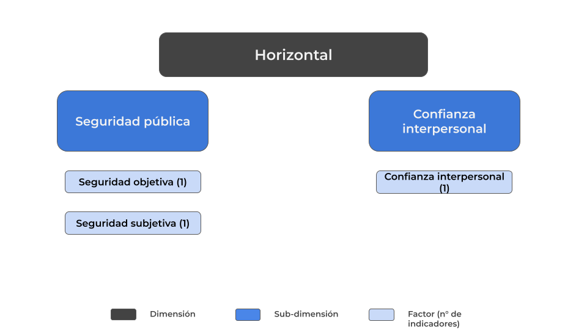
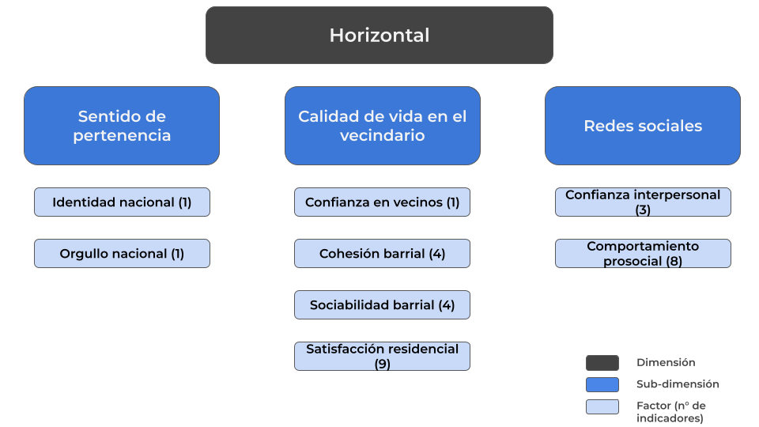
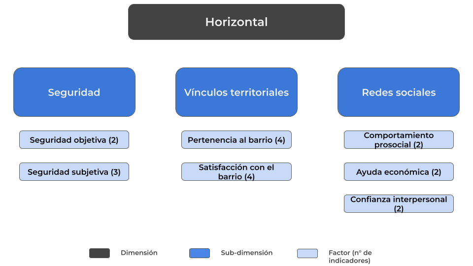

# Propuesta de Cohesión Horizontal

```{r}
#| echo: false
library(knitr)
library(kableExtra)
library(dplyr)
library(readr)
```


## Antecedentes

El concepto de cohesión social horizontal se constituye a partir de una crítica a las definiciones previas, que solían confundir sus contenidos con condiciones externas como la pobreza, la igualdad de oportunidades o la tolerancia. Frente a ello, Chan et al., 2006 proponen una definición minimalista que identifique los elementos constitutivos de la cohesión sin diluir su valor analítico. En este marco, la cohesión horizontal se entiende como el conjunto de actitudes y comportamientos que regulan las relaciones entre individuos y grupos dentro de la sociedad, independientemente del Estado.

Conceptualmente, incluye la confianza generalizada entre ciudadanos, la disposición a cooperar y ayudar más allá de las fronteras grupales y el sentido compartido de pertenencia. Operacionalmente, estos componentes se expresan en indicadores subjetivos (confianza interpersonal, voluntad de cooperar, identificación con la comunidad) y objetivos (participación en asociaciones, voluntariado, donaciones, cooperación o divisiones entre grupos). Así, la cohesión horizontal adquiere una forma precisa y medible, lo que permite evaluar comparativamente el grado de integración social entre ciudadanos en distintos contextos.

Anteriormente, desde el Observatorio de Cohesión Social (OCS-COES) ya se ha incursionado en la representación empírica de la cohesión social horizontal. Específicamente desde una perspectiva comparada regional a partir de encuestas internacionales como LAPOP y WVS. En este marco, la cohesión parte de su comprensión como un entramado de vínculos entre ciudadanos y grupos sociales, expresada en actitudes subjetivas y prácticas objetivas de interacción. A nivel conceptual, esta dimensión se ha estructurado en tres subdimensiones principales: sentido de pertenencia, calidad de vida en el vecindario y redes sociales.



En primer lugar, el sentido de pertenencia mide el grado en que las personas se reconocen como parte de una comunidad política nacional y expresan orgullo de pertenecer a ella. LAPOP incluye indicadores de orgullo y deber de apoyar al sistema político, mientras que WVS incorpora preguntas sobre orgullo nacional y disposición a defender al país en caso de guerra. De acuerdo con los análisis factoriales realizados, el indicador más robusto para esta dimensión es el orgullo nacional (WVS).

En segundo lugar, la calidad de vida en el vecindario combina tanto percepciones subjetivas como condiciones objetivas del entorno. LAPOP ofrece indicadores sobre seguridad urbana y victimización, así como satisfacción con servicios básicos; mientras que WVS incluye la confianza en los vecinos. El análisis empírico muestra que las variables más consistentes para esta subdimensión son la seguridad urbana y la confianza en los vecinos, lo que refleja cómo las experiencias cotidianas de convivencia impactan la percepción de cohesión.

Finalmente, las redes sociales se refieren a la participación en organizaciones civiles y a comportamientos prosociales. LAPOP capta la asistencia a reuniones religiosas, escolares y vecinales, además de un indicador de confianza interpersonal, mientras que WVS aporta ítems de comportamiento cívico como el rechazo a sobornos, la disposición a pagar impuestos o el uso honesto del transporte público. Tras los análisis de consistencia interna, se consolidaron dos indicadores principales: la confianza interpersonal y las conductas prosociales.

Este marco a nivel regional permite observar cómo la cohesión horizontal en América Latina se articula alrededor de un sentido compartido de pertenencia nacional, la calidad de las interacciones locales y la densidad de redes sociales. Si bien los indicadores específicos varían según encuesta, la lógica de Chan et al. (2006) se mantiene: integrar tanto actitudes subjetivas como comportamientos objetivos para capturar las relaciones entre ciudadanos y grupos sociales. 

### Cohesión Social Horizontal en Chile



Para el caso chileno, la encuesta ELSOC, como bien ya han mostrado Castillo et al. (2021), permite operacionalizar la dimensión horizontal de la cohesión social a partir de la distinción tanto de indicadores subjetivos —como el sentido de pertenencia, la confianza y la apertura a la diversidad— como indicadores objetivos —como la participación social y las prácticas prosociales—. Estos se organizan en cuatro grandes subdimensiones: sentido de pertenencia, confianza social, cohesión barrial y sociabilidad local, y participación y prosocialidad.

La primera, sentido de pertenencia, se capta a través de ítems del módulo de Sociabilidad Política que indagan sobre el grado de identificación con Chile y el orgullo nacional. Estas preguntas reflejan el vínculo simbólico y afectivo de las personas con la comunidad política nacional y permiten observar hasta qué punto los individuos se reconocen como parte de un colectivo común.

La segunda, confianza social, incluye indicadores tanto de confianza interpersonal generalizada como de confianza en los vecinos. Preguntas como “¿Se puede confiar en la mayoría de las personas o hay que tener cuidado?” o “¿Cuánto confía en sus vecinos?” miden las expectativas que los individuos tienen respecto al comportamiento de los otros, constituyendo un elemento central de la cohesión horizontal según Chan et al., en tanto facilita la cooperación entre desconocidos.

La tercera, cohesión barrial y sociabilidad local, se refiere a la integración y calidad de las relaciones en el espacio cotidiano del vecindario. ELSOC incluye ítems sobre la percepción de integración al barrio, la identificación con sus habitantes y el nivel de colaboración entre vecinos. Estos indicadores permiten analizar la cohesión en un nivel micro, donde la interacción directa fortalece o debilita los lazos comunitarios.

Finalmente, la subdimensión de participación social y prosocialidad incorpora conductas concretas que muestran la disposición de las personas a involucrarse en la vida social y apoyar a otros. ELSOC mide este aspecto a través de la participación en voluntariado, las donaciones a causas sociales, el apoyo económico o material a otras personas, y el acompañamiento en situaciones de dificultad. Estas acciones representan la expresión objetiva de la cohesión horizontal, pues reflejan la voluntad de contribuir activamente al bienestar colectivo.

Un componente adicional lo constituye la aceptación de la diversidad, expresada en actitudes hacia grupos sociales distintos, como migrantes o minorías sexuales. Estos indicadores permiten observar hasta qué punto la cohesión se sustenta no solo en la homogeneidad, sino también en la inclusión de la diferencia y el reconocimiento mutuo, aspecto clave en el marco de sociedades crecientemente diversas.

Ahora bien, las propuestas presentadas tienen diferencias importantes.

1) En primer lugar, con ELSOC es mucho más compleja en tanto tiene mayores niveles de granularidad y, consecuentemente, mayor cantidad de factores en comparación con la propuesta de que se construye para Latinoamérica con LAPOP, cuya perspectiva es más minimalista.

Esto se expresa en, por ejemplo, la subdimensión de confianza en instituciones y democracia. En la propuesta con ELSOC esta se entiende como una subdimensión compuesta de dos factores: confianza en instituciones y satisfacción con la democracia. No así, en la propuesta construida con LAPOP estos factores se entienden como dos subdimensiones independientes.

2) Por su parte, en la propuesta con ELSOC se consideran varias subdimensiones que no están presentes en el índice de Latinoamérica debido a decisiones basadas en inconsistencia teórica y/o estadística, tal como el factor de comportamiento prosocial, el cual intentó integrarse en con datos de WVS y, si bien la consistencia interna del factor era aceptable, no correlacionaba con los demás factores de su dimensión.

3) Finalmente, hay que decir que las propuestas no comparten ningún factor de sus subdimensiones. Si bien ambas integran el índice confianza interpersonal en su medición, ELSOC la considera como un factor de segundo orden, mientras que en la propuesta de LAPOP es un factor de primer orden.


## Propuesta de Medición con ELSOC




```{r}
#| echo: false

# Cargar los datos
datos <- read_delim("../../input/tables/variables-final.csv", 
                    delim = ";", 
                    show_col_types = FALSE,
                    locale = locale(encoding = "UTF-8"))

# Función para formatear categorías de respuesta con saltos de línea
formatear_categorias_kable <- function(datos) {
  # Buscar columnas que contengan categorías de respuesta
  columnas_categorias <- grep("categor|respuesta|opcion|alternativa", colnames(datos), ignore.case = TRUE)
  
  if(length(columnas_categorias) > 0) {
    for(col in columnas_categorias) {
      # Reemplazar separadores con saltos de línea HTML
      datos[[col]] <- gsub(";", ";<br>", datos[[col]])
      datos[[col]] <- gsub(",", ",<br>", datos[[col]])
      datos[[col]] <- gsub("\\|", "<br>", datos[[col]])
      datos[[col]] <- gsub("\\n", "<br>", datos[[col]])  # Por si ya hay saltos de línea
    }
  }
  return(datos)
}

# Aplicar formateo
datos_formateados <- formatear_categorias_kable(datos)

# Crear tabla con kable + kableExtra
tabla_principal <- datos_formateados %>%
  kable(format = "html", 
        caption = "<strong>Operacionalización de Variables</strong>",
        escape = FALSE,  # Permitir HTML en las celdas
        table.attr = "style='width:100%;'") %>%
  
  # Estilo general de la tabla
  kable_styling(
    bootstrap_options = c("striped", "hover", "condensed", "responsive"),
    full_width = TRUE,
    position = "center",
    font_size = 12,
    fixed_thead = TRUE  # Fijar encabezados al hacer scroll
  ) %>%
  
  # Estilo de la primera columna (generalmente el nombre de la variable)
  column_spec(1, 
              bold = TRUE, 
              background = "#f8f9fa",
              width = "15em") %>%
  
  # Estilo para todas las columnas
  column_spec(2:ncol(datos_formateados),
              width = "20em",
              extra_css = "vertical-align: top; line-height: 1.4;") %>%
  
  # Scroll horizontal y vertical
  scroll_box(width = "100%", 
             height = "600px",
             extra_css = "border: 1px solid #ddd;") %>%
  
  # Agregar CSS personalizado para mejor formato
  add_header_above(header = c(" " = ncol(datos_formateados)), 
                   background = "#e9ecef",
                   color = "#495057")

# Mostrar la tabla
tabla_principal 
```

La propuesta del OCS para medir la cohesión social horizontal a través de la ELSOC se organiza en tres dimensiones principales: seguridad, vínculos territoriales y redes sociales. Cada una integra factores e indicadores específicos que permiten observar tanto las condiciones objetivas como las percepciones y prácticas asociadas a la vida comunitaria.

La seguridad se mide desde un plano objetivo y subjetivo. En el primer caso, se consideran la frecuencia de peleas callejeras y la frecuencia de robos y/o asaltos en el barrio durante los últimos doce meses, indicadores que muestran la exposición a situaciones de riesgo. En el plano subjetivo, se incluyen la frecuencia de tráfico de drogas en el vecindario, la satisfacción con la seguridad del barrio y la percepción individual de sentirse seguro o inseguro en su entorno, lo que aporta una mirada sobre cómo los residentes evalúan y experimentan estas condiciones.

Los vínculos territoriales buscan capturar el grado de identificación y valoración del espacio de residencia. Esta dimensión se divide en dos factores. El primero, la pertenencia al barrio, incluye cuatro indicadores: considerar que el barrio es ideal, sentirse integrado, identificarse con los vecinos y percibirlo como parte de la propia identidad. El segundo, la satisfacción con el barrio, se mide a través de la facilidad para hacer amigos, la sociabilidad, la cordialidad y la colaboración de los vecinos, reflejando así la calidad de las relaciones comunitarias.

La tercera dimensión corresponde a las redes sociales, que permiten observar las dinámicas de confianza, solidaridad y cooperación entre personas. Se estructura en tres factores. La confianza interpersonal considera la disposición a confiar en los demás y la percepción de que las personas tienden a ayudar a otros o a centrarse en sí mismas. El comportamiento prosocial se mide mediante la participación en reuniones comunitarias y la realización de voluntariado en los últimos doce meses. Finalmente, la ayuda económica se evalúa a través de la disposición a prestar dinero y a colaborar en la búsqueda de empleo para alguien más.

Este esquema integra distintos planos de análisis —condiciones objetivas, percepciones subjetivas, identidades territoriales y prácticas sociales— para ofrecer una mirada amplia de la cohesión horizontal.

- Incluir un esquema o tabla de operacionalización (este es el punto más importante).
- Agregar también una tabla con la disponibilidad de indicadores por ola, en formato wide (variables en filas, olas en columnas).

### Análisis

- Likertplot descriptivo de cada ítem
- Correlaciones (corrplot)
- Análisis Factorial Exploratorio
- Construcción de índices y sus descriptivos (Media, desviación estándar, distribución y consistencia con los ítems usados)