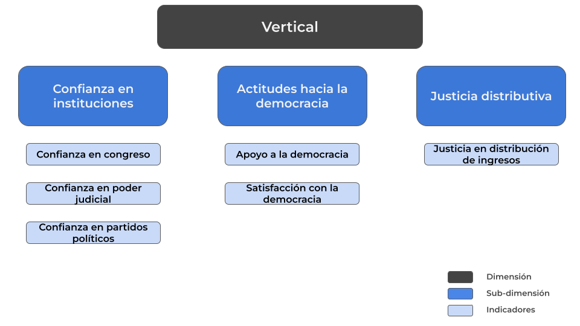
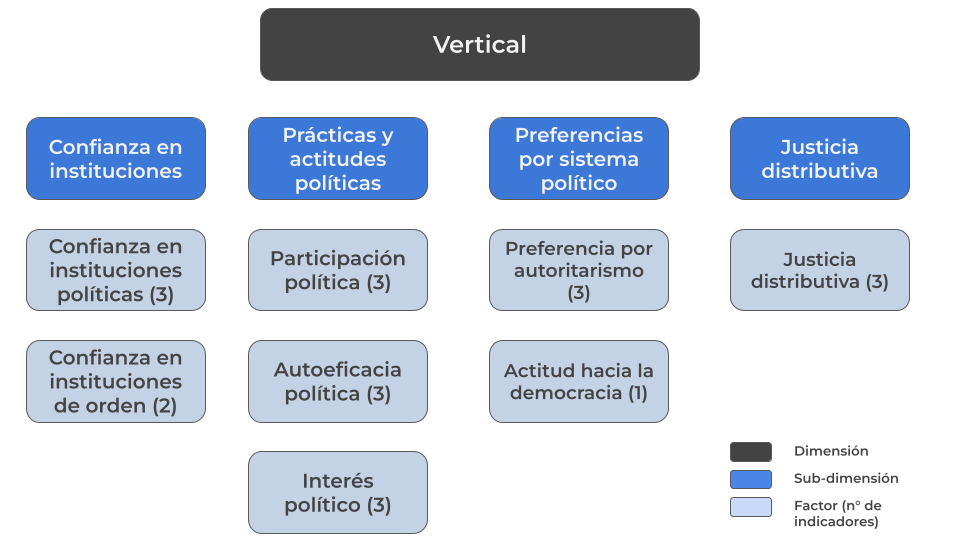

## Antecedentes

A partir de una necesidad de aclarar una definición de cohesión social, Chan et al (2006) propone un marco analítico minimalista con un enfoque bidimensional para la comprensión y medición de este concepto. La dimensión horizontal fue explicada el capítulo anterior, mientras que la dimensión vertical de la cohesión social alude a capturar las interacciones entre individuos e instituciones y/o aparatos supraindividuales de la sociedad.

En cuanto a su operacionalización, esta dimensión posee dos componentes: el subjetivo y el objetivo. El primero refiere a las actitudes de los sujetos, expresado en la confianza hacia instituciones de la sociedad, o bien en la confianza en figuras públicas. El segundo componente apunta a las manifestaciones conductuales de las personas, abordando distintos planos de la participación política, tales como el voto o la pertenencia a agrupaciones políticas. De esta manera, la cohesión vertical se vuelve un concepto clarificado operacionalmente hablando, posibilirando la medición del vínculo social entre los individuos y las estructuras sociales que lo rodean.

En momentos anteriores, el Observatorio de Cohesión Social (OCS) ya ha concentrado sus esfuerzos en proponer un marco analítico de cohesión social vertical en base a lo planteado por Chan et al. (2006), pero con una pretensión en el estudio de América Latina. Para ello, se utilizó la base de datos LAPOP y Latinobarómetro para construir la propuesta presentada en la @fig-ocs-la. Conceptualmente, este esquema se conforma mediante tres subdimensiones: Confianza en instituciones, actitudes hacia la democracia y justicia distributiva.

```{r}
#| label: fig-ocs-la
#| echo: false 


```

Confianza en instituciones mide el grado de fiabilidad que sienten las personas respecto al congreso, al poder judicial y a los partidos políticos.

Actitudes hacia la democracia busca medir las percepciones afectivas en torno al sistema político actual, considerando cuánto apoya un individuo a la democracia, y además la satisfacción respecto a ella.

Por último, justicia distributiva mide el grado de acuerdo con la idea de que los ingresos deberían ser redistribuidos igualitariamente en la sociedad.

## Nueva propuesta de medición con ELSOC

Con la idea de actualizar el marco analítico de la cohesión social, apuntando a una medición y operacionalización más pertinente, completa y fiable, se ha elaborado la siguiente propuesta, resumida en el siguiente esquema conceptual.

```{r}
#| label: fig-ocs-nueva
#| echo: false


```

La nueva propuesta del OCS se visualiza en @fig-ocs-nueva, conformándose a partir de cuatro subdimensiones: Confianza en instituciones, prácticas y actitudes políticas, preferencias por sistema político y justicia distributiva.

La subdimensión confianza en instituciones aborda dos factores; el primero considera el grado de confianza respecto a instituciones políticas, donde se considera el Gobierno, el Congreso y los partidos políticos; el segundo mide el grado de confianza hacia instituciones que buscan defender el orden y la seguridad pública, tales como carabineros y la fuerza armada. Todos los indicadores incluidos en esta subdimensión fueron medidos mediante una escala likert de cinco alternativas, yendo desde "Nada" hasta "Mucha".

Para entregar una mayor claridad respecto a los códigos originales de las variables y su disponibilidad en cada ola, se puede revisar la @tbl-propuesta-nueva.

```{r}
#| label: tbl-propuesta-nueva
#| echo: false 

library(readr)
library(DT)

datos <- read_delim("tables/tbl-elsoc-ver.csv", 
                    delim = ",", 
                    show_col_types = FALSE)

datatable(datos)

```

## Análisis

```{r}
#| label: packages
#| message: false 
#| echo: false 

if (! require("pacman")) install.packages("pacman")

pacman::p_load(tidyverse,
               car,
               sjmisc, 
               here,
               sjlabelled,
               SciViews,
               naniar,
               readxl,
               sjPlot,
               lme4,
               ggdist,
               purrr,
               psych,
               corrplot,
               skimr)


options(scipen=999)
rm(list = ls())
```

```{r}
#| label: data
#| echo: false 

load(url("https://dataverse.harvard.edu/api/access/datafile/10797987"))
```

### Procesamiento de los datos

```{r}
#| label: processing

elsoc <- elsoc_long_2016_2023 %>%
  select(idencuesta, ola, c05_01, c05_02, c05_05, c05_07, c05_03, c05_10,
         c08_01, c08_02, c08_03, c08_04, c10_01, c10_02, c10_03, c13, c14_01,
         c14_02, c18_04, c18_05, c18_07, d02_01, d02_02, d02_03, c01) %>%
  rename(conf_gobierno = c05_01, conf_pp = c05_02, conf_judicial = c05_05, conf_congreso = c05_07, 
         conf_carabineros = c05_03, conf_fa = c05_10, 
         firma_peticion = c08_01, asiste_marcha = c08_02, part_huelga = c08_03,
         opinion_rrss = c08_04, voto_deber = c10_01, voto_influye = c10_02, 
         voto_expresion = c10_03, interes_politica = c13, 
         hablar_politica = c14_01, infopolitica_medios = c14_02, 
         gobierno_firme = c18_04, mandatario_fuerte = c18_05, 
         vida_disciplinar = c18_07, justicia_pensiones = d02_01,
         justicia_educacion = d02_02, justicia_salud = d02_03, sat_democracia = c01)

missing_codes <- c(-999, -888, -777, -666)
elsoc <- elsoc %>%
  mutate(across(everything(), ~ sjlabelled::set_na(.x, na = missing_codes)))
```

## Descriptivos 

::: {.panel-tabset}

### Confianza en gobierno

```{r}
#| label: fig-confianza

plot_stackfrq(elsoc$conf_gobierno,
              show.prc = FALSE,
              show.n = FALSE,
              show.total = TRUE) + 
  theme_ggdist()
```

### Confianza en partidos políticos
```{r}
plot_stackfrq(elsoc$conf_pp,
              show.prc = FALSE,
              show.n = FALSE,
              show.total = TRUE) + 
  theme_ggdist()
```

### Confianza en congreso
```{r}
plot_stackfrq(elsoc$conf_congreso,
              show.prc = FALSE,
              show.n = FALSE,
              show.total = TRUE) + 
  theme_ggdist()
```

### Confianza en carabineros
```{r}
plot_stackfrq(elsoc$conf_carabineros,
              show.prc = FALSE,
              show.n = FALSE,
              show.total = TRUE) + 
  theme_ggdist()
```

### Confianza en fuerzas armadas
```{r}
plot_stackfrq(elsoc$conf_fa,
              show.prc = FALSE,
              show.n = FALSE,
              show.total = TRUE) + 
  theme_ggdist()
```
:::

## Correlaciones

**Confianza en instituciones**

```{r}
confianza <- elsoc[, c("conf_gobierno", "conf_pp",
                       "conf_congreso", "conf_carabineros", "conf_fa")]

poly_cor1 <- polychoric(confianza)
```

```{r}
#| label: fig-corr-conf

corrplot(poly_cor1$rho, method = "color", 
         type = "upper", 
         tl.col = "black", 
         tl.srt = 45, 
         addCoef.col = "black", # muestra los coeficientes
         number.cex = 0.7)
```

### Análisis factorial exploratorio (EFA)

Ya que este paso se fundamenta en comprobar la dimensionalidad de los constructos, más que para averiguar si hay cambios en la estabilidad de las escalas, se aplicará el EFA sobre una base filtrada por la última ola que dispone de las variables a utilizar.

**Confianza en instituciones**

```{r}
#| include: false 

elsoc_confianza <- elsoc %>%
  filter(ola == 6) %>%
  select(conf_gobierno, conf_pp, conf_congreso,
         conf_carabineros, conf_fa)

cormat1  <- cor(elsoc_confianza, use = "pairwise.complete.obs") 
 
 KMO(cormat1) 
cortest.bartlett(cormat1, n = 2730)
```

```{r}
#| label: fig-efa-conf
#| fig-cap: Tabla de factorial exploratorio de Confianza en instituciones
#| fig-cap-location: top
#| echo: false 
#| message: false 

tab_fa(elsoc_confianza, rotation = "varimax", show.comm = TRUE)
```

A partir del cálculo de la adecuación factorial de KMO y el test de esfericidad de Bartlett, se determina que es viable aplicar un análisis factorial exploratorio con los indicadores seleccionados. En @fig-efa-conf se puede apreciar que el análisis sugiere dos factores. En el primero se agrupan las instituciones de orden, mientras que en el segundo se reúnen las instituciones políticas.

### Construcción de índices

**Confianza en instituciones**

```{r}
elsoc <- elsoc %>%
  mutate(conf_inst_pol = rowMeans(select(., conf_gobierno, conf_congreso, conf_pp), na.rm = TRUE))
```

```{r}
t_conf <- elsoc %>%
  select(conf_inst_pol) %>%
  skim() %>%
  yank("numeric") %>%
  as_tibble() %>%
  mutate(range = paste0("(", p0, "-", p100, ")")) %>%
  mutate_if(is.numeric, ~ round(., 2)) %>%
  select("Variable" = skim_variable,
         "Mean" = mean,
         "SD" = sd,
         "Range" = range,
         "Histogram" = hist)

# 3. Calcular alfa de Cronbach de las 3 variables originales
alpha_conf <- psych::alpha(elsoc %>%
                             select(conf_gobierno, conf_congreso, conf_pp))

cronbach_alpha <- round(alpha_conf$total$raw_alpha, 2)

# 4. Agregar columna con alfa de Cronbach (misma fila del índice)
t_conf <- t_conf %>%
  mutate(Cronbach_Alpha = cronbach_alpha)

t_conf
```
