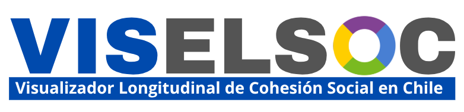

# Visualizador Longitudinal de Cohesión Social en Chile {background-color="#40764bff"}

## ¿Qué es el VisELSOC?

Una **herramienta interactiva** construida a partir de los datos del Estudio Longitudinal Social de Chile (ELSOC-COES)

- Individuos que participaron en **al menos 3 olas** del estudio entre 2016 y 2023

- De libre acceso

::: {style="text-align: center;"}
{width=60%}
:::

## Funcionalidades de VISELSOC

### 1. Visualización Longitudinal
- Compara promedios de dimensiones a través del tiempo (gráficos de líneas)

### 2. Visualización Ranking

- Muestra cambios temporales en los indicadores específicos de cada subdimensión

### 3. Visualización Bivariada

- Cruza subdimensiones de cohesión con variables sociodemográficas

## Característicoas VISELSOC

- Todos los indicadores, subdimensiones y dimensiones fueron construidos a partir de porcentajes de respuestas a categorías alta y muy alta.

- Los gráficos del visualizador se pueden descargar y utilizar libremente. 

::: {.callout-tip .xlarge}

# Para citar:

Urzúa, T., Iturra, J., Canales, R., Laffert, A. & Castillo, J. (2025). Visualizador Longitudinal de Cohesión Social de Chile 2016-2023. Observatorio de Cohesión Social OCS, https://doi.org/10.5281/zenodo.17408345.

:::
