# Análisis longitudinal VISELSOC{background-color="#40764bff"} 

## Subdimensiones a analizar

:::{.small}

### Confianza en instituciones políticas:
- Considera el grado de confianza que tienen los sujetos hacia las instituciones de orden político de la sociedad, tales como el Gobierno, el Congreso y los partidos políticos.

### Preferencias autoritarias
- El grado de acuerdo respecto a ideales autoritarios, como la preferencia por gobiernos firmes, mandatarios fuertes y la obediencia como valor clave (re-escalada: valores altos indican mayor desacuerdo con posiciones autoritarias (mayor preferencia por normas democráticas).

### Confianza interpersonal
- El nivel de confianza hacia otras personas y el acuerdo en que los demás actúan de manera altruista (re-escalada: valores altos indican mayor confianza interpersonal).
:::

##

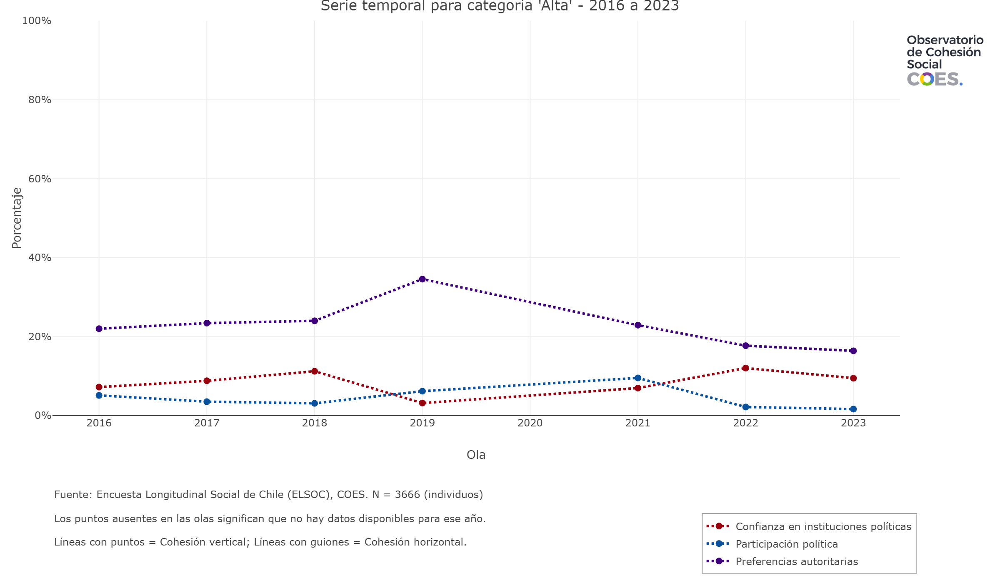{width=90%}

## Confianza en Instituciones Políticas por Edad  

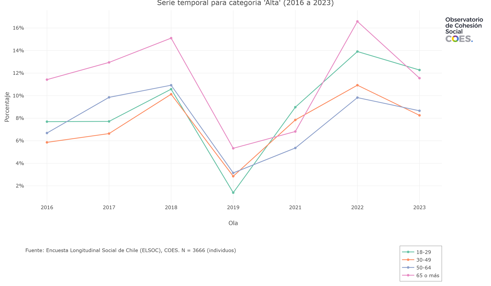{width=90%}

## Confianza en Instituciones Políticas por Educación  

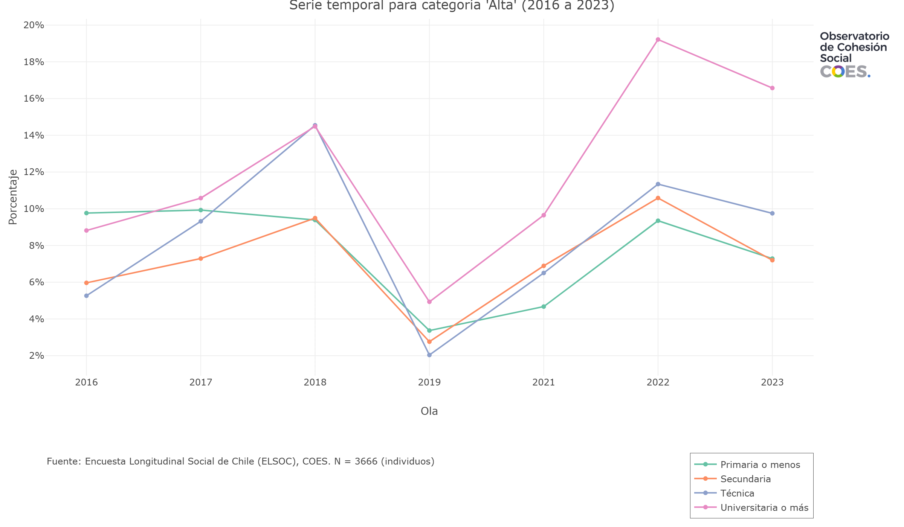{width=90%}

## Confianza en Instituciones Políticas por Ideología  

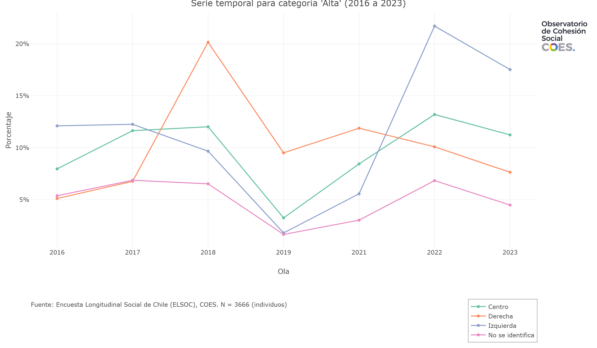{width=90%}

## Confianza en Instituciones Políticas por Ingreso  

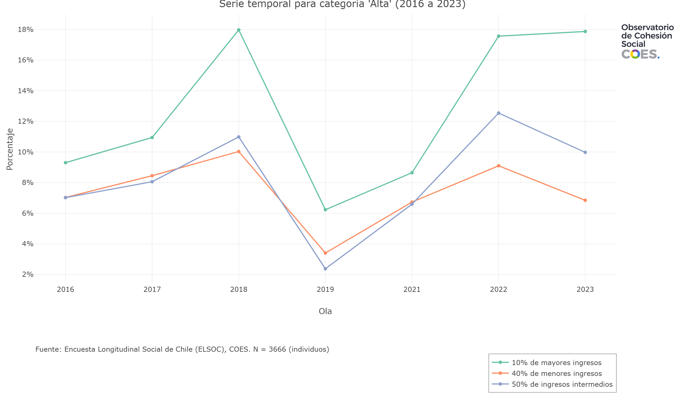{width=90%}

## Preferencias Autoritarias por Edad  

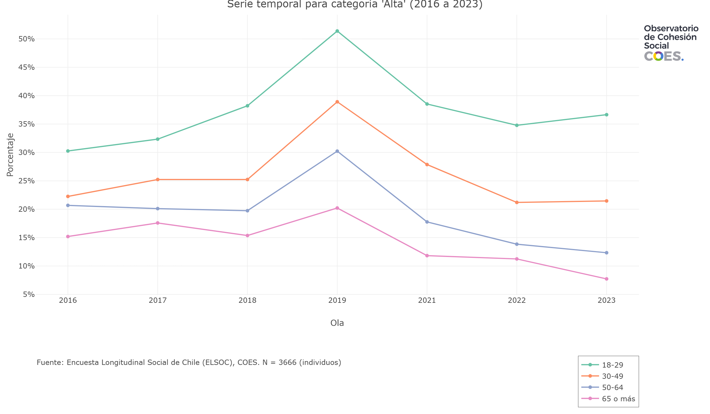{width=90%}

## Preferencias Autoritarias por Educación  

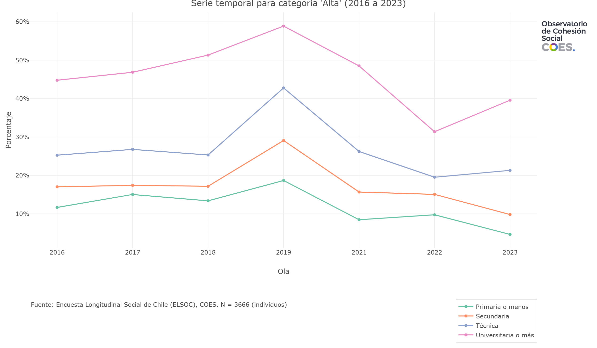{width=90%}

## Preferencias Autoritarias por Ideología  

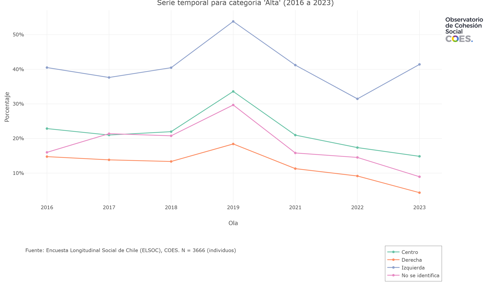{width=90%}

## Preferencias Autoritarias por Ingreso  

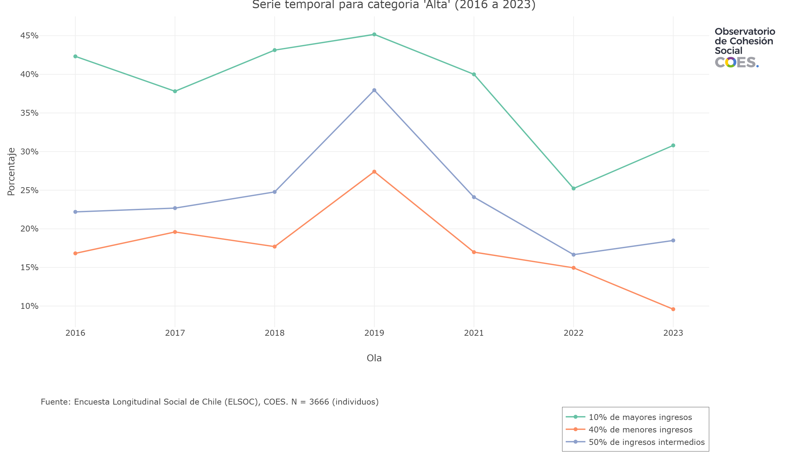{width=90%}

## Confianza Interpersonal por Edad  

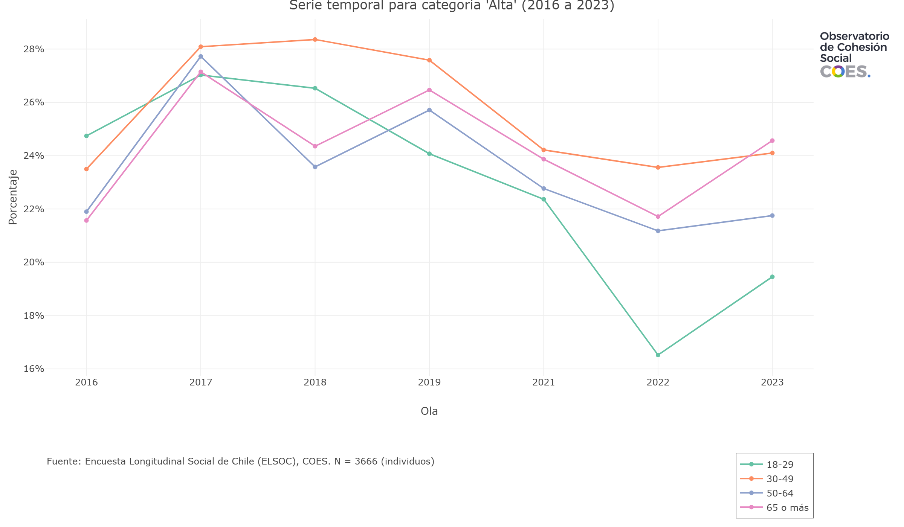{width=90%}

## Confianza Interpersonal por Educación  

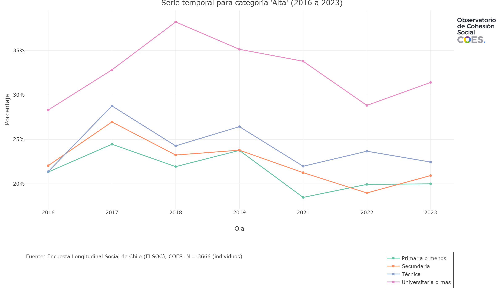{width=90%}

## Confianza Interpersonal por Ideología  

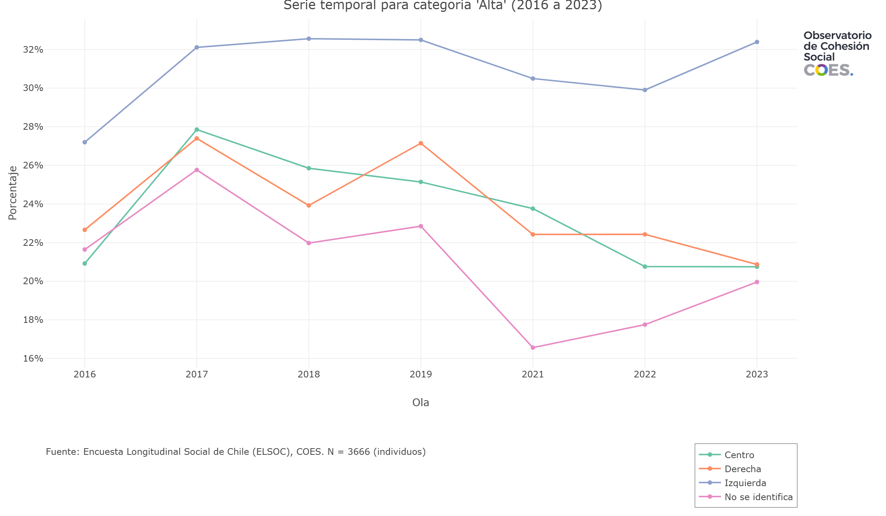{width=90%}

## Confianza Interpersonal por Ingreso  

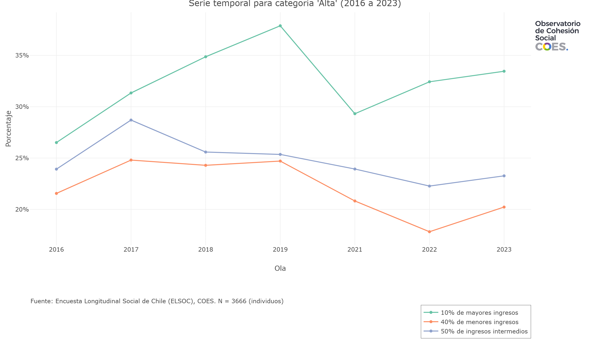{width=90%}