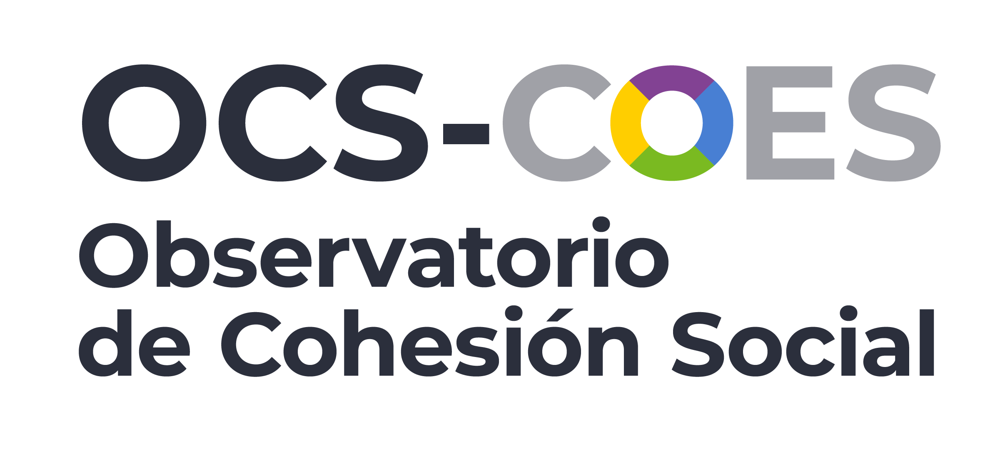

## Conclusiones {background-color="#40764bff"}

- Cohesión como concepto resiliente

- Conceptualización multidimensional minimalista

- ELSOC como oportunidad de generar indicadores de cambio en cohesión social en Chile

- Edad, educación e ideología se relacionan con cambios en indicadores de cohesión social

- Posibilidades: variables territoriales, modelamiento longitudinal, asociación entre dimensiones

## Gracias por su atención! {background-color="#4b8b58ff" style="text-align: right;"}

  

  <a href="https://ocs-coes.com/" style="color:rgb(10, 40, 11); font-size: 2.5em; text-decoration: none;">
    coes.cl/ocs
  </a>

